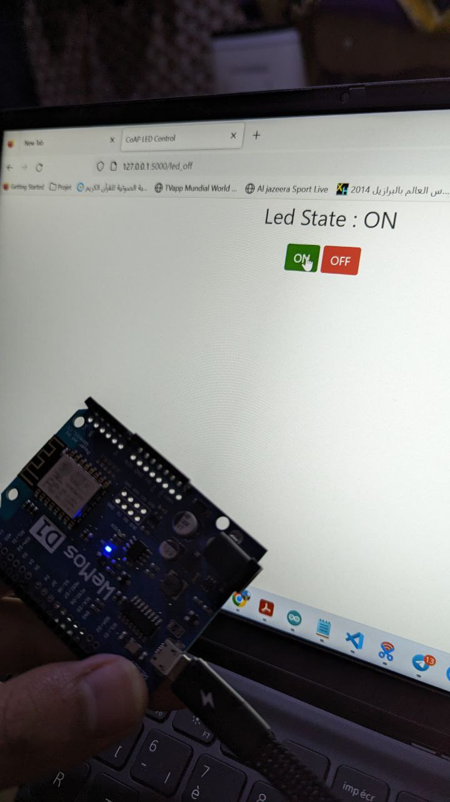
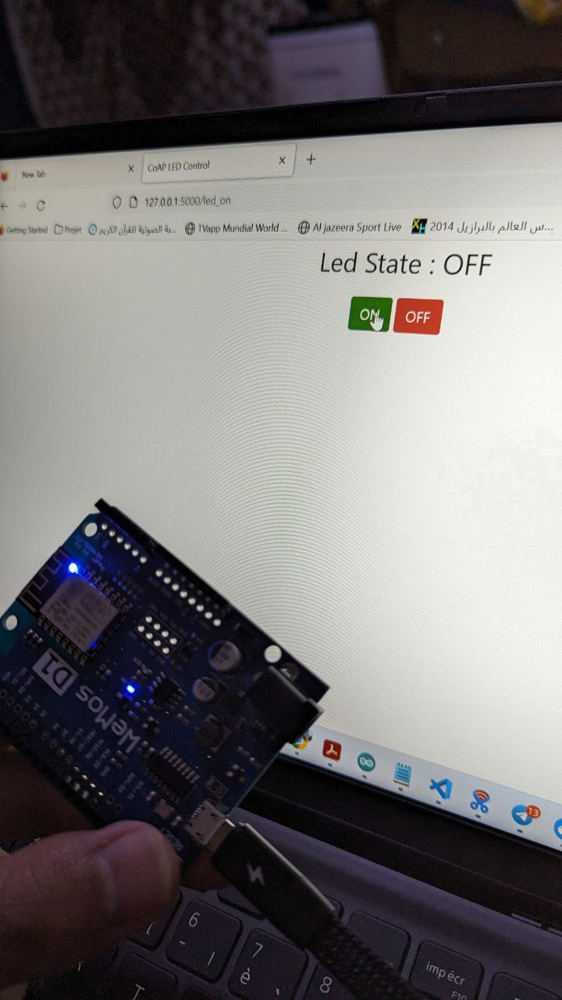

### SATOUTAH Haithem Grp01 ISI

### ACHAB Houssem    Grp02 ISI
# Rapport Tp2 IOT
## Final Result
<div style="text-align:center;">
  
  
</div>

# introduction
>The provided code implements a basic Internet of Things (IoT) project where an ESP8266 acts as a CoAP server, controlling an LED and providing a temperature reading. Concurrently, a Flask web application serves as a CoAP client, enabling users to interact with the IoT system through a web interface. The ESP8266 responds to CoAP requests to toggle the LED state and retrieve the current temperature, while the Flask application facilitates user control and displays the LED's status on a web page. This collaborative setup illustrates a straightforward example of bidirectional communication in an IoT environment

# Python Code 

```python
from flask import Flask, render_template, request
from coapthon.client.helperclient import HelperClient


app = Flask(__name__)


COAP_SERVER_IP = '192.168.43.96'
# COAP_SERVER_PORT = 5683
# COAP_LED_ENDPOINT = '/LED'


# def send_coap_request(data):
#     try:
#         client = HelperClient(server=(COAP_SERVER_IP, COAP_SERVER_PORT))
#         response = client.post(COAP_LED_ENDPOINT, data)
#         return response
#     except Exception as e:
#         return f"Error: {e}"
#     finally:
#         client.stop()

@app.route('/')
def index():

    return render_template('index.html', state='OFF')

@app.route('/led_off', methods=['POST'])
def led_on():
    client = HelperClient(server=(COAP_SERVER_IP, 5683))
    response = client.post('/LED', 'On')
    #response = send_coap_request('On')
    client.stop()
    return render_template('index.html', state='ON')

@app.route('/led_on', methods=['POST'])
def led_off():
    client = HelperClient(server=(COAP_SERVER_IP, 5683))
    response = client.post('/LED', 'Off')
    return render_template('index.html', state='OFF')

if __name__ == '__main__':
    app.run(debug=True)
```

# Arduino Code 


```c
#include <ESP8266WiFi.h>
#include "Thing.CoAP.h"
#include "Thing.CoAP/Server.h"
#include "Thing.CoAP/ESP/UDPPacketProvider.h"

Thing::CoAP::Server server;
Thing::CoAP::ESP::UDPPacketProvider udpProvider;

char* ssid = "Aa1";
char* password = "Haithem2023";
#define LED 2
#define BUTTON 0
float temp = 0.0;

void setup() {
  Serial.begin(115200);
  Serial.println("Initializing");

  pinMode(LED, OUTPUT);
  pinMode(BUTTON, INPUT_PULLUP);

  WiFi.begin(ssid, password);

  while (WiFi.status() != WL_CONNECTED) {
    delay(1000);
    Serial.println("Connecting to WiFi..");
  }

  Serial.println("Connected to the WiFi network");
  Serial.println("My IP: ");
  Serial.println(WiFi.localIP());

  server.SetPacketProvider(udpProvider);
 
  server.CreateResource("LED", Thing::CoAP::ContentFormat::TextPlain, true)
    .OnGet([](Thing::CoAP::Request & request) {
      Serial.println("GET Request received for endpoint 'LED'");
      Serial.println(LED);

      std::string result;
      if (digitalRead(LED) == HIGH)
        result = "On";
      else
        result = "Off";

      return Thing::CoAP::Status::Content(result);
    })
    .OnPost([](Thing::CoAP::Request& request) {
      Serial.println("POST Request received for endpoint 'LED'");
      auto payload = request.GetPayload();
      std::string message(payload.begin(), payload.end());
      Serial.print("The client sent the message: ");
      Serial.println(message.c_str());
      if (message == "On") {
        digitalWrite(LED, HIGH);
      } else if (message == "Off") {
        digitalWrite(LED, LOW);
      } else {
        return Thing::CoAP::Status::BadRequest();
      }
      return Thing::CoAP::Status::Created("ok merci");
    });

  server.CreateResource("temp", Thing::CoAP::ContentFormat::TextPlain, false)
    .OnGet([](Thing::CoAP::Request & request) {
      Serial.println("GET Request received for endpoint 'temp'");
      std::string result;
      result = String(temp).c_str();
      return Thing::CoAP::Status::Content(result);
    });

  server.Start();
}

void loop() {
  temp += 1;
  Serial.println(temp);
  server.Process();
  delay(1000);
}
  
```

# Html code 

```html
<!DOCTYPE html>
<html>

<head>
  <title>CoAP LED Control</title>
  <link href="https://stackpath.bootstrapcdn.com/bootstrap/4.3.1/css/bootstrap.min.css" rel="stylesheet" type="text/css">
  <style>
    .inline-form {
      display: inline-block;
    }
  </style>
</head>

<body>
  <div class="container" style="text-align:center;">

    <p style='font-size:30px;'>
      Led State :
      <span id='state'>{{ state }}</span>
    </p>

    <form class="inline-form" action="/led_on" method="post">
      <button class="btn btn-success" type="submit">ON</button>
    </form>

    <form class="inline-form" action="/led_off" method="post">
      <button class="btn btn-danger" type="submit">OFF</button>
    </form>

  </div>
</body>

</html>
```